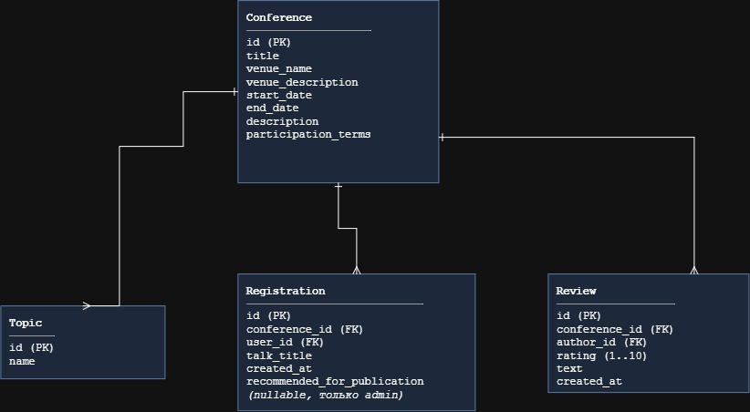
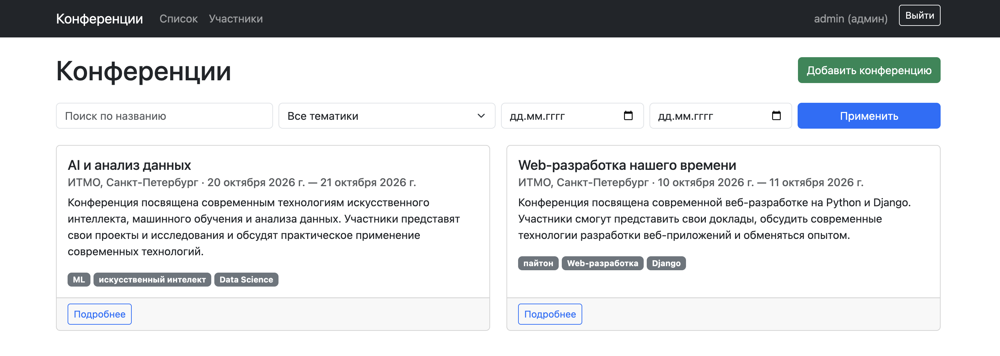
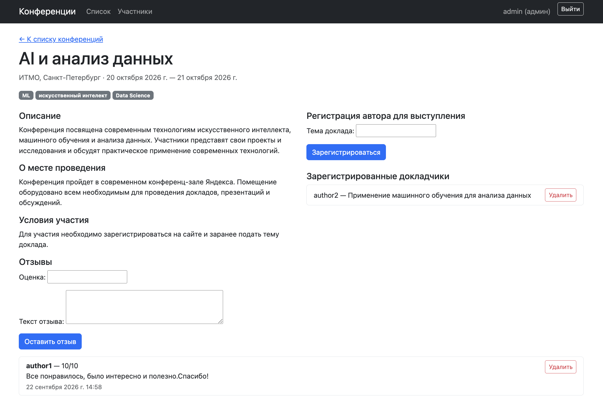
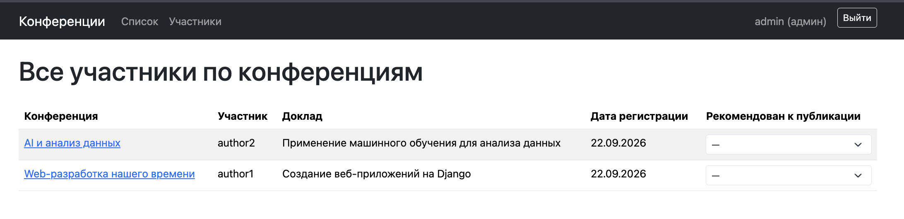
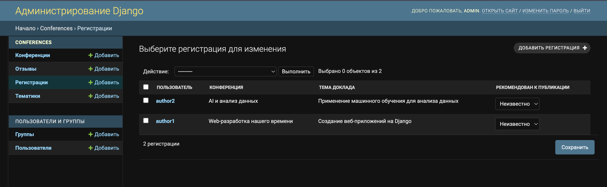
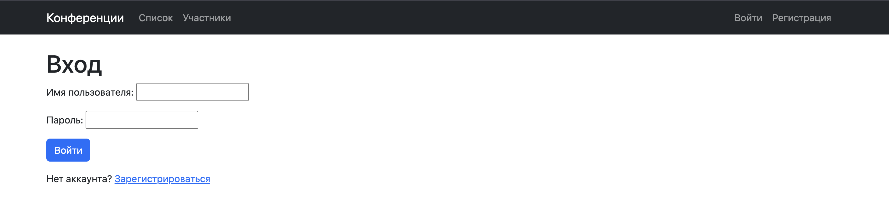
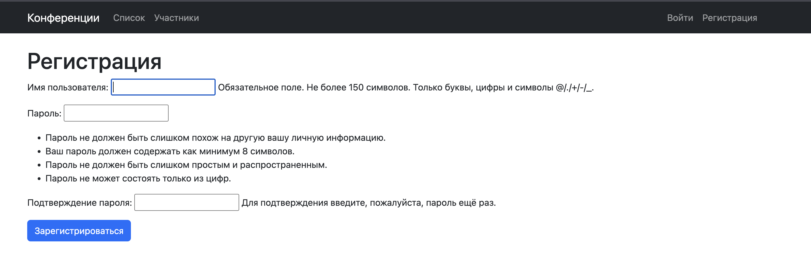
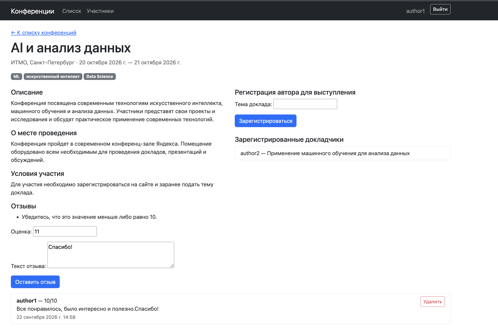

# ЛР2 — модель данных, views, шаблоны, скриншоты

## Модель данных

Четыре модели: `Topic`, `Conference`, `Registration`
(регистрация автора на выступление) и `Review` (отзыв). `Registration` и
`Review` ссылаются на пользователя через `settings.AUTH_USER_MODEL`
(стандартный `User`).



`recommended_for_publication` — nullable `BooleanField`: `None` — решение ещё
не принято, `True`/`False` — рекомендован/не рекомендован. Редактируется
только администратором (Django-admin и отдельный dropdown в клиентской
таблице участников).

## Ключевые views

| View | URL | Тип | Доступ | Назначение |
|---|---|---|---|---|
| `ConferenceListView` | `/` | CBV `ListView` | все | список конференций: поиск по названию, фильтр по тематике и датам, пагинация (`paginate_by=6`) |
| `conference_create` | `/conferences/new/` | FBV | только `is_staff` | создание конференции с клиента (иначе `PermissionDenied`) |
| `conference_detail` | `/conferences/<pk>/` | FBV | все | карточка конференции + формы регистрации/отзыва |
| `registration_create` | `/conferences/<pk>/register/` | FBV | авторизован | регистрация автора на выступление |
| `registration_update` / `registration_delete` | `/registrations/<pk>/edit\|delete/` | FBV | владелец или `is_staff` | редактирование/удаление регистрации |
| `review_create` | `/conferences/<pk>/review/` | FBV | авторизован | отзыв: рейтинг 1–10 + текст |
| `review_delete` | `/reviews/<pk>/delete/` | FBV | автор или `is_staff` | удаление отзыва |
| `ParticipantsListView` | `/participants/` | CBV `ListView` | все | таблица всех регистраций по всем конференциям, пагинация (`paginate_by=10`) |
| `registration_set_recommendation` | `/registrations/<pk>/recommend/` | FBV | только `is_staff` | dropdown «рекомендован к публикации» прямо в таблице участников |
| `signup` | `/signup/` | FBV | все | регистрация пользователя (`UserCreationForm`) |

Права доступа проверяются на сервере во `views.py` с помощью `@login_required` , `user.is_staff` и `PermissionDenied`. Дополнительно в шаблонах элементы интерфейса скрываются от пользователей, которым соответствующие действия недоступны

## Шаблоны

```
conferences/templates/
├── base.html                              — общий layout, навигация, Bootstrap 5 (CDN)
├── registration/
│   ├── login.html                         — вход
│   └── signup.html                        — регистрация пользователя
└── conferences/
    ├── conference_list.html               — список + форма фильтра/поиска + пагинация
    ├── conference_form.html               — создание конференции (staff)
    ├── conference_detail.html             — карточка конференции, формы регистрации/отзыва
    ├── registration_form.html             — редактирование своей регистрации
    ├── registration_confirm_delete.html   — подтверждение удаления регистрации
    ├── review_confirm_delete.html         — подтверждение удаления отзыва
    ├── participants.html                  — таблица участников + dropdown для staff
    └── _pagination.html                   — переиспользуемый пагинатор (список + таблица)
```

## Скриншоты

**Список конференций** — поиск, фильтр по тематике/датам, пагинация,
кнопка «Добавить конференцию» видна только администратору.



**Карточка конференции** — описание, форма регистрации на выступление,
список докладчиков, форма и список отзывов.



**Таблица участников** — `/participants/`, для администратора колонка
«Рекомендован к публикации» — выпадающий список (—/Да/Нет), у обычного
пользователя — просто текст.



**Django-admin** — список `Registration` с полем `recommended_for_publication`
как `list_editable`.



**Вход / регистрация** — вход выполняется с использованием стандартной формы Django AuthenticationForm, регистрация — с использованием UserCreationForm, поля переведены
на русский (`LANGUAGE_CODE = 'ru'`).




**Ошибка валидации** — рейтинг отзыва вне диапазона 1–10 показывает
понятную ошибку под полем, а не молча отбрасывается.


