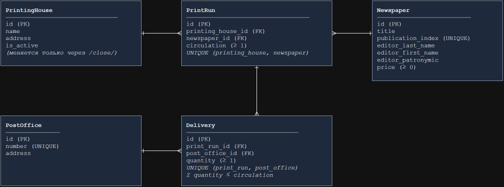

# ЛР3. Отчёт — Серверная часть на Django REST Framework


**Вариант 6 — «Распределение газет по почтовым отделениям».** 

## Модель данных



`Newspaper ⇄ PrintingHouse` — связь «многие-ко-многим» через промежуточную модель `PrintRun` (тираж). Каждая поставка `Delivery` — это часть конкретного тиража, отправленная в одно почтовое отделение. Связи на диаграмме — «один-ко-многим» (черта — сторона «один», «воронья лапка» — сторона «многие»).

| Модель | Поля | Ограничения |
|---|---|---|
| `Newspaper` (газета) | `title`, `publication_index`, `editor_last_name`, `editor_first_name`, `editor_patronymic`, `price`; M2M `printing_houses` через `PrintRun` | индекс уникален; цена ≥ 0 |
| `PrintingHouse` (типография) | `name`, `address`, `is_active` | |
| `PostOffice` (почтовое отделение) | `number`, `address` | номер уникален |
| `PrintRun` (тираж газеты в типографии) | FK `printing_house`, FK `newspaper`, `circulation` | пара (типография, газета) уникальна; тираж ≥ 1 |
| `Delivery` (поставка в отделение) | FK `print_run`, FK `post_office`, `quantity` | пара (тираж, отделение) уникальна; количество ≥ 1 |

`related_name` задан у связей: `PrintingHouse.print_runs`, `Newspaper.print_runs`, `PrintingHouse.newspapers`, `PrintRun.deliveries`, `PostOffice.deliveries`.


---

## Эндпоинты

Базовый адрес приложения — `http://127.0.0.1:8000`. Для доступа к эндпоинтам `/api/...` пользователь должен быть авторизован с помощью токена или сессии браузера. При обращении без авторизации сервер возвращает ответ **401 Unauthorized**. В URL параметр `{id}` обозначает идентификатор конкретного объекта. Если объекта с указанным `id` не существует, сервер возвращает **404 Not Found**.

### Авторизация (Djoser)

| Метод | URL | Параметры | Ответ |
|---|---|---|---|
| POST | `/auth/users/` | тело: `username`, `password` | 201 `{email, username, id}`; 400 — логин занят или слабый пароль |
| POST | `/auth/token/login/` | тело: `username`, `password` | 200 `{auth_token}`; 400 — неверные данные |
| POST | `/auth/token/logout/` | заголовок с токеном | 204, токен удалён |
| GET | `/auth/users/me/` | заголовок с токеном | 200 `{email, id, username}` |
| GET, POST | `/api-auth/login/` | форма: `username`, `password` | вход в browsable API (сессия) |
| GET, POST | `/api-auth/logout/` | — | выход из browsable API |

### CRUD

Для каждой основной сущности предусмотрены URL для работы со списком объектов и с отдельным объектом. Для списка используются `GET` (получение всех объектов) и `POST` (создание нового объекта). Для отдельного объекта используются `GET` (получение по `id`), `PUT` (полное редактирование), `PATCH` (частичное редактирование) и `DELETE` (удаление).

| Метод | URL | Параметры (тело запроса) | Ответ |
|---|---|---|---|
| GET | `/api/newspapers/` | — | 200 список газет |
| POST | `/api/newspapers/` | `title`, `publication_index` (уникальный), `editor_last_name`, `editor_first_name`, `editor_patronymic` (можно пустым), `price` (≥ 0) | 201 газета; 400 — индекс занят, цена < 0 |
| GET | `/api/newspapers/{id}/` | — | 200 газета: все поля и `printing_houses` (id типографий) |
| PUT / PATCH | `/api/newspapers/{id}/` | те же поля (PATCH — любые из них, например только `price` или `publication_index`) | 200 газета; 400 — ошибка валидации |
| DELETE | `/api/newspapers/{id}/` | — | 204; тиражи и поставки газеты удаляются каскадно |
| GET | `/api/printing-houses/` | — | 200 список типографий |
| POST | `/api/printing-houses/` | `name`, `address` | 201 типография, `is_active: true` |
| GET | `/api/printing-houses/{id}/` | — | 200 `{id, name, address, is_active}` |
| PUT / PATCH | `/api/printing-houses/{id}/` | `name`, `address` (`is_active` только для чтения и игнорируется) | 200 типография |
| DELETE | `/api/printing-houses/{id}/` | — | 204; тиражи и поставки удаляются каскадно |
| GET | `/api/post-offices/` | — | 200 список отделений |
| POST | `/api/post-offices/` | `number` (уникальный), `address` | 201 отделение; 400 — номер занят |
| GET | `/api/post-offices/{id}/` | — | 200 `{id, number, address}` |
| PUT / PATCH | `/api/post-offices/{id}/` | `number`, `address` | 200 отделение |
| DELETE | `/api/post-offices/{id}/` | — | 204; поставки в отделение удаляются каскадно |
| GET | `/api/print-runs/` | — | 200 список тиражей |
| POST | `/api/print-runs/` | `printing_house` (id), `newspaper` (id), `circulation` (≥ 1) | 201 тираж; 400 — пара типография + газета уже есть, типография закрыта |
| GET | `/api/print-runs/{id}/` | — | 200 `{id, circulation, printing_house, newspaper}` |
| PUT / PATCH | `/api/print-runs/{id}/` | те же поля | 200 тираж; 400 — тираж меньше уже распределённого, перенос в закрытую типографию |
| DELETE | `/api/print-runs/{id}/` | — | 204; поставки тиража удаляются каскадно |
| GET | `/api/deliveries/` | — | 200 список поставок |
| POST | `/api/deliveries/` | `print_run` (id), `post_office` (id), `quantity` (≥ 1) | 201 поставка; 400 — сумма поставок превысит тираж, пара тираж + отделение уже есть |
| GET | `/api/deliveries/{id}/` | — | 200 `{id, quantity, print_run, post_office}` |
| PUT / PATCH | `/api/deliveries/{id}/` | те же поля | 200 поставка; 400 — превышен тираж |
| DELETE | `/api/deliveries/{id}/` | — | 204 |

### Вложенные объекты и операция

| Метод | URL | Параметры | Ответ |
|---|---|---|---|
| GET | `/api/printing-houses/{id}/print-runs/` | `{id}` типографии | 200 `[{id, circulation, newspaper: {id, title, publication_index, price}}]` — один-ко-многим |
| GET | `/api/post-offices/{id}/deliveries/` | `{id}` отделения | 200 `[{id, quantity, printing_house: {id, name, address}, newspaper: {id, title, publication_index}}]` — один-ко-многим |
| GET | `/api/newspapers/{id}/printing-houses/` | `{id}` газеты | 200 `[{printing_house: {id, name, address, is_active}, circulation}]` — многие-ко-многим |
| POST | `/api/printing-houses/{id}/close/` | `{id}` типографии, тело не нужно | 200 `{printing_house_id, moves: [{newspaper_id, to_printing_house_id, circulation}]}`; 409 — уже закрыта или это последняя работающая |

### Аналитика, справка и отчёт

| Метод | URL | Параметры | Ответ |
|---|---|---|---|
| GET | `/api/analytics/newspapers/{id}/printing-addresses/` | `{id}` газеты | 200 `[{name, address, printing_house_id}]` — адреса типографий, где печатается газета |
| GET | `/api/analytics/printing-houses/{id}/top-editor/` | `{id}` типографии | 200 `{newspaper: {id, title}, circulation, editor_last_name}` — газета с самым большим тиражом; 404 — у типографии нет тиражей |
| GET | `/api/analytics/post-offices-by-price/` | `price_gt` — число, обязательный | 200 `[{id, number, address}]` — отделения, куда поступает газета дороже `price_gt`; 400 — параметр не задан или не число |
| GET | `/api/analytics/low-deliveries/` | `quantity_lt` — целое, обязательный | 200 `[{newspaper: {id, title, publication_index}, post_office: {id, number}, total_quantity}]` — количество суммируется по всем типографиям; 400 — параметр не задан или не целое |
| GET | `/api/analytics/newspapers/{id}/destinations/` | `{id}` газеты; `address` — адрес типографии (точное совпадение), обязательный | 200 `[{post_office: {id, number, address}, quantity}]`; 400 — нет `address` |
| GET | `/api/analytics/newspapers/{id}/reference/` | `{id}` газеты | 200 `{id, title, publication_index, price}` — справка об индексе и цене |
| GET | `/api/reports/printing-houses/` | — | 200 `[{id, name, address, is_active, total_copies, by_newspaper: [{newspaper, circulation}], shipments: [{post_office, items: [{newspaper, quantity}]}]}]` — отчёт по каждой типографии |


---
## Примеры запросов

Ниже приведены примеры запросов к API и получаемых ответов. В примерах используются данные, находящиеся в базе данных проекта.

### 1. Получение списка газет

**Запрос:**

```http
GET /api/newspapers/
```

**Ответ:**

```json
[
  {
    "id": 1,
    "title": "Вечерний город",
    "publication_index": "П1001",
    "editor_last_name": "Смирнов",
    "editor_first_name": "Алексей",
    "editor_patronymic": "Петрович",
    "price": "25.00",
    "printing_houses": [1, 2]
  },
  {
    "id": 2,
    "title": "Городские вести",
    "publication_index": "П1002",
    "editor_last_name": "Кузнецова",
    "editor_first_name": "Ольга",
    "editor_patronymic": "Ивановна",
    "price": "30.50",
    "printing_houses": [1, 3]
  },
  {
    "id": 3,
    "title": "Спорт-экспресс",
    "publication_index": "П1003",
    "editor_last_name": "Орлов",
    "editor_first_name": "Дмитрий",
    "editor_patronymic": "Сергеевич",
    "price": "45.00",
    "printing_houses": [2]
  },
  {
    "id": 4,
    "title": "Наука и жизнь",
    "publication_index": "П1004",
    "editor_last_name": "Волкова",
    "editor_first_name": "Мария",
    "editor_patronymic": "Андреевна",
    "price": "60.00",
    "printing_houses": [3]
  }
]
```

### 2. Получение определенной(№1)  газеты по id

**Запрос:**

```http
GET /api/newspapers/1/
```

**Ответ:**

```json
{
  "id": 1,
  "title": "Вечерний город",
  "publication_index": "П1001",
  "editor_last_name": "Смирнов",
  "editor_first_name": "Алексей",
  "editor_patronymic": "Петрович",
  "price": "25.00",
  "printing_houses": [1, 2]
}
```

### 3. Получение типографий, в которых печатается определенная газета

Для газеты «Вечерний город» с `id = 1`:

```http
GET /api/newspapers/1/printing-houses/
```

**Ответ:**

```json
[
  {
    "printing_house": {
      "id": 1,
      "name": "Типография №1",
      "address": "ул. Садовая, 10",
      "is_active": true
    },
    "circulation": 5000
  },
  {
    "printing_house": {
      "id": 2,
      "name": "Типография №2",
      "address": "пр. Победы, 25",
      "is_active": true
    },
    "circulation": 2000
  }
]
```

### 4. Получение адресов, где печатается выбранная газета

Для газеты «Вечерний город» с `id = 1`:

```http
GET /api/analytics/newspapers/1/printing-addresses/
```

**Ответ:**

```json
[
  {
    "name": "Типография №1",
    "address": "ул. Садовая, 10",
    "printing_house_id": 1
  },
  {
    "name": "Типография №2",
    "address": "пр. Победы, 25",
    "printing_house_id": 2
  }
]
```

### 5. Получение редактора газеты с наибольшим тиражом в типографии

Для типографии с `id = 2`:

```http
GET /api/analytics/printing-houses/2/top-editor/
```

**Ответ:**

```json
{
  "newspaper": {
    "id": 3,
    "title": "Спорт-экспресс"
  },
  "circulation": 8000,
  "editor_last_name": "Орлов"
}
```

### 6. Получение почтовых отделений, куда поступают газеты дороже заданной цены

Например, выберем газеты стоимостью больше `40`:

```http
GET /api/analytics/post-offices-by-price/?price_gt=40
```

**Ответ:**

```json
[
  {
    "id": 2,
    "number": "102",
    "address": "ул. Мира, 12"
  },
  {
    "id": 3,
    "number": "103",
    "address": "пр. Космонавтов, 40"
  }
]
```

### 7. Получение газет, поступающих в почтовые отделения в количестве меньше заданного

Например, зададим количество меньше `1000` экземпляров:

```http
GET /api/analytics/low-deliveries/?quantity_lt=1000
```

**Ответ:**

```json
[
  {
    "newspaper": {
      "id": 1,
      "title": "Вечерний город",
      "publication_index": "П1001"
    },
    "post_office": {
      "id": 3,
      "number": "103"
    },
    "total_quantity": 500
  },
  {
    "newspaper": {
      "id": 2,
      "title": "Городские вести",
      "publication_index": "П1002"
    },
    "post_office": {
      "id": 2,
      "number": "102"
    },
    "total_quantity": 500
  },
  {
    "newspaper": {
      "id": 4,
      "title": "Наука и жизнь",
      "publication_index": "П1004"
    },
    "post_office": {
      "id": 2,
      "number": "102"
    },
    "total_quantity": 200
  },
  {
    "newspaper": {
      "id": 4,
      "title": "Наука и жизнь",
      "publication_index": "П1004"
    },
    "post_office": {
      "id": 3,
      "number": "103"
    },
    "total_quantity": 300
  }
]
```

### 8. Получение почтовых отделений, куда поступает определенная газета из указанной типографии

Для газеты «Вечерний город» с `id = 1`, которая печатается по адресу `ул. Садовая, 10`:

```http
GET /api/analytics/newspapers/1/destinations/?address=ул.%20Садовая,%2010
```

**Ответ:**

```json
[
  {
    "post_office": {
      "id": 1,
      "number": "101",
      "address": "ул. Ленина, 5"
    },
    "quantity": 2000
  },
  {
    "post_office": {
      "id": 2,
      "number": "102",
      "address": "ул. Мира, 12"
    },
    "quantity": 2500
  }
]
```

### 9. Получение справки об индексе и цене выбранной газеты

Для газеты «Вечерний город» с `id = 1`:

```http
GET /api/analytics/newspapers/1/reference/
```

**Ответ:**

```json
{
  "id": 1,
  "title": "Вечерний город",
  "publication_index": "П1001",
  "price": "25.00"
}
```

### 10. Получение отчёта по типографиям

**Запрос:**

```http
GET /api/reports/printing-houses/
```

Ответ:

```json
[
  {
    "id": 1,
        "name": "Типография №1",
        "address": "ул. Садовая, 10",
        "is_active": true,
        "total_copies": 8000,
        "by_newspaper": [
            {
                "newspaper": {
                    "id": 1,
                    "title": "Вечерний город"
                },
                "circulation": 5000
            },
            {
                "newspaper": {
                    "id": 2,
                    "title": "Городские вести"
                },
                "circulation": 3000
            }
        ],
        "shipments": [
            {
                "post_office": {
                    "id": 1,
                    "number": "101",
                    "address": "ул. Ленина, 5"
                },
                "items": [
                    {
                        "newspaper": {
                            "id": 1,
                            "title": "Вечерний город"
                        },
                        "quantity": 2000
                    },
                    {
                        "newspaper": {
                            "id": 2,
                            "title": "Городские вести"
                        },
                        "quantity": 1000
                    }
                ]
            },
            {
                "post_office": {
                    "id": 2,
                    "number": "102",
                    "address": "ул. Мира, 12"
                },
                "items": [
                    {
                        "newspaper": {
                            "id": 1,
                            "title": "Вечерний город"
                        },
                        "quantity": 2500
                    }
                ]
            },
            {
                "post_office": {
                    "id": 3,
                    "number": "103",
                    "address": "пр. Космонавтов, 40"
                },
                "items": [
                    {
                        "newspaper": {
                            "id": 2,
                            "title": "Городские вести"
                        },
                        "quantity": 1500
                    }
                ]
            }
        ]
    },
    {
        "id": 2,
        "name": "Типография №2",
        "address": "пр. Победы, 25",
        "is_active": true,
        "total_copies": 10000,
        "by_newspaper": [
            {
                "newspaper": {
                    "id": 1,
                    "title": "Вечерний город"
                },
                "circulation": 2000
            },
            {
                "newspaper": {
                    "id": 3,
                    "title": "Спорт-экспресс"
                },
                "circulation": 8000
            }
        ],
        "shipments": [
            {
                "post_office": {
                    "id": 1,
                    "number": "101",
                    "address": "ул. Ленина, 5"
                },
                "items": [
                    {
                        "newspaper": {
                            "id": 1,
                            "title": "Вечерний город"
                        },
                        "quantity": 1000
                    }
                ]
            },
            {
                "post_office": {
                    "id": 2,
                    "number": "102",
                    "address": "ул. Мира, 12"
                },
                "items": [
                    {
                        "newspaper": {
                            "id": 3,
                            "title": "Спорт-экспресс"
                        },
                        "quantity": 4000
                    }
                ]
            },
            {
                "post_office": {
                    "id": 3,
                    "number": "103",
                    "address": "пр. Космонавтов, 40"
                },
                "items": [
                    {
                        "newspaper": {
                            "id": 1,
                            "title": "Вечерний город"
                        },
                        "quantity": 500
                    },
                    {
                        "newspaper": {
                            "id": 3,
                            "title": "Спорт-экспресс"
                        },
                        "quantity": 3000
                    }
                ]
            }
        ]
    },
    {
        "id": 3,
        "name": "Типография №3",
        "address": "ул. Заводская, 7",
        "is_active": true,
        "total_copies": 2200,
        "by_newspaper": [
            {
                "newspaper": {
                    "id": 2,
                    "title": "Городские вести"
                },
                "circulation": 1500
            },
            {
                "newspaper": {
                    "id": 4,
                    "title": "Наука и жизнь"
                },
                "circulation": 700
            }
        ],
        "shipments": [
            {
                "post_office": {
                    "id": 1,
                    "number": "101",
                    "address": "ул. Ленина, 5"
                },
                "items": [
                    {
                        "newspaper": {
                            "id": 2,
                            "title": "Городские вести"
                        },
                        "quantity": 800
                    }
                ]
            },
            {
                "post_office": {
                    "id": 2,
                    "number": "102",
                    "address": "ул. Мира, 12"
                },
                "items": [
                    {
                        "newspaper": {
                            "id": 2,
                            "title": "Городские вести"
                        },
                        "quantity": 500
                    },
                    {
                        "newspaper": {
                            "id": 4,
                            "title": "Наука и жизнь"
                        },
                        "quantity": 200
                    }
                ]
            },
            {
                "post_office": {
                    "id": 3,
                    "number": "103",
                    "address": "пр. Космонавтов, 40"
                },
                "items": [
                    {
                        "newspaper": {
                            "id": 4,
                            "title": "Наука и жизнь"
                        },
                        "quantity": 300
                    }
                ]
            }
        ]
    }
]
```